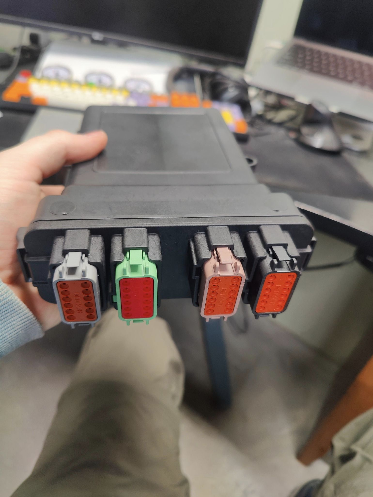

# Open Source Sensor Module



OSSM is an open-source automotive sensor module that reads temperature, pressure, and environmental sensors and transmits data over CAN bus using the J1939 protocol. It emulates a secondary ECM, allowing gauges and data loggers to display sensor data alongside factory instrumentation.

## Features

- **8 temperature inputs** - NTC thermistor sensors
- **7 pressure inputs** - 0.5-4.5V analog sensors
- **EGT input** - K-type thermocouple (configurable for other types)
- **Ambient sensing** - Temperature, humidity, barometric pressure (BME280)
- **J1939 protocol** - Standard CAN bus communication at 250 kbps
- **Runtime configuration** - No recompilation needed, settings stored in EEPROM
- **CAN bus configuration** - Configure over J1939 without USB access

## Hardware Requirements

- OSSM PCB (Teensy 4.0 based)
- 12V power supply
- CAN bus connection (CANL/CANH with 120Ω termination)
- Compatible sensors

## Pinout

| Pin A | Pin B | Pin C | Pin D |
|-------|-------|-------|-------|
| 1. Ground | 1. temp3 - | 1. temp5 + | 1. SCL (BME280) |
| 2. pres2 Signal | 2. temp3 Signal | 2. pres3 + | 2. SDA (BME280) |
| 3. temp2 + | 3. pres1 Signal | 3. pres6 + | 3. Ground (BME280) |
| 4. temp1 + | 4. temp4 + | 4. pres4 Signal | 4. temp5 - |
| 5. pres2 + | 5. pres5 + | 5. temp7 + | 5. pres3 - |
| 6. pres7 + | 6. pres1 + | 6. temp6 + | 6. pres3 Signal |
| 7. **12V Power** | 7. pres5 + | 7. pres4 Signal | 7. **CANL** |
| 8. 5V (BME280) | 8. pres1 - | 8. pres4 - | 8. **CANH** |
| 9. Ground | 9. temp4 - | 9. temp6 - | 9. EGT - |
| 10. pres2 - | 10. pres5 - | 10. temp8 - | 10. EGT + |
| 11. temp2 - | 11. temp8 Signal | 11. pres7 - | 11. pres6 - |
| 12. temp1 - | 12. pres6 Signal | 12. pres4 + | 12. temp8 - |

## Quick Start

1. **Connect power**: 12V to pin A7, ground to A1 or A9
2. **Connect CAN bus**: CANL to D7, CANH to D8
3. **Wire sensors**: Connect NTC/pressure sensors to desired inputs
4. **Configure via J1939**: Send commands on PGN 65280 (see below)
5. **Verify output**: Monitor PGNs for sensor data

On first boot, all sensors are disabled. Enable SPNs and assign them to inputs using J1939 commands.

## J1939 Configuration

OSSM accepts configuration commands on **PGN 65280 (0xFF00)** and responds on **PGN 65281 (0xFF01)**.

### Enable SPN

```
Byte 0: 0x01 (Enable command)
Byte 1: SPN high byte
Byte 2: SPN low byte
Byte 3: 1 = enable, 0 = disable
Byte 4: Input number (1-8 for temp, 1-7 for pressure)
```

**Example**: Enable SPN 175 (oil temp) on temp3:
```
01 00 AF 01 03
```

### Save Configuration

```
Byte 0: 0x06 (Save command)
```

Saves current configuration to EEPROM.

### Common SPNs

| SPN | Description | Input Type |
|-----|-------------|------------|
| 175 | Engine Oil Temperature | temp1-8 |
| 110 | Coolant Temperature | temp1-8 |
| 100 | Engine Oil Pressure | pres1-7 |
| 102 | Boost Pressure | pres1-7 |
| 173 | Exhaust Gas Temperature | EGT (no input) |
| 171 | Ambient Temperature | BME280 (no input) |

See [SPN Reference](docs/SPN-REFERENCE.md) for complete list.

## J1939 Output

OSSM transmits sensor data on standard J1939 PGNs:

| PGN | Interval | Data |
|-----|----------|------|
| 65262 | 1s | Oil temp, coolant temp, fuel temp |
| 65263 | 500ms | Oil pressure, coolant pressure, fuel pressure |
| 65269 | 1s | Ambient temp, air inlet temp, barometric |
| 65270 | 500ms | EGT, boost, intake temp, inlet pressure |

Only enabled SPNs are transmitted. Disabled SPNs show as 0xFF (Not Available).

## Building from Source

```bash
# Install PlatformIO
pip install platformio

# Build
pio run

# Upload to Teensy
pio run -t upload
```

## Documentation

- [Serial Commands](docs/SERIAL-COMMANDS.md) - USB serial configuration interface
- [SPN Reference](docs/SPN-REFERENCE.md) - Complete SPN and PGN details
- [Hardware Setup](docs/HARDWARE-SETUP.md) - Wiring and installation guide
- [Architecture](docs/ARCHITECTURE.md) - Technical design documentation
- [QA Checklist](docs/QA-CHECKLIST.md) - Testing procedures

## Contributing

See [CONTRIBUTING.md](CONTRIBUTING.md) for development setup and guidelines.

## License

MIT License - see [LICENSE](LICENSE) for details.

---

**Note**: J1939 implementation is based on reverse engineering and publicly available information. Test thoroughly before relying on this for critical applications.
