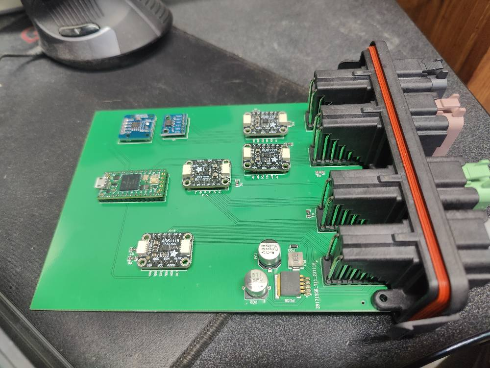

# Open Source Sensor Module

This software is designed to emulate a second PCM/ECM and read a bunch of sensors and send the data over the appropriate J1939 PGNs. Everything in this repo is learned from reverse engineering, using data found on github, things shared on facebook, etc. So do your own testing if you decide to use it.

## Sensors

This Sensor Module can read and provide data for up to 19 sensors.

1. Ambient Temp
2. Relative Humidity
3. Absolute Barometric Pressure
4. EGT
5. Oil Temperature
6. Oil Pressure
7. Coolant Temperature
8. Coolant Pressure
9. Transfer Pipe Temperature
10. Transfer Pipe Pressure
11. Boost Pressure
12. Boost Temperature
13. CAC Inlet Pressure
14. CAC Inlet Temperature
15. Air Inlet Temperature
16. Air Inlet Pressure
17. Fuel Pressure
18. Fuel Temperature
19. Engine Bay Temperature

## Pinout

The hardware has 48 pins on 4 plugs and is pinned out as follows.

| Pin A                   | Pin B                      | Pin C                        | Pin D                            |
| ----------------------- | -------------------------- | ---------------------------- | -------------------------------  |
| 1. Fuel Pressure -      | 1. Oil Temperature +       | 1. CAC Inlet Pressure +      | 1. Transfer Pipe Temperature -   |
| 2. Fuel Pressure Signal | 2. Oil Pressure Signal     | 2. CAC Inlet Temperature +   | 2. Transfer Pipe Pressure -      |
| 3. Fuel Temp +          | 3. Coolant Temperature +   | 3. Air Inlet Temperature +   | 3. Boost Temperature -           |
| 4. Engine Bay Temp +    | 4. Coolant Pressure Signal | 4. Air Inlet Pressure Signal | 4. Can Shield Ground             |
| 5. Fuel Temp -          | 5. Oil Temperature -       | 5. Air Inlet Pressure +      | 5. Egt+                          |
| 6. Engine Bay Temp -    | 6. Oil Pressure -          | 6. Boost Pressure +          | 6. Egt-                          |
| 7. 12 Volt Power        | 7. Coolant Temperature -   | 7. Air Inlet Pressure -      | 7. Boost Pressure -              |
| 8. 5 Volts for BME280   | 8. Coolant Pressure -      | 8. CAC Inlet Pressure Signal | 8. Transfer Pipe Temperature +   |
| 9. Ground               | 9. Oil Pressure +          | 9. CAC Inlet Pressure -      | 9. Transfer Pipe Pressure Signal |
| 10. Ground for BME280   | 10. Coolant Pressure +     | 10. CAC Inlet Temperature -  | 10. Boost Pressure Signal        |
| 11. SCL for BME280      | 11. CanH                   | 11. Air Inlet Temperature -  | 11. Boost Temperature +          |
| 12. SDA for BME280      | 12. CanL                   | 12. Fuel Pressure +          | 12. Transfer Pipe Pressure +     |

## J1939

This module sends the sensor data over canbus using J1939 messages.

PGN 65269 - 1 seconds
    spn171 Ambient Air Temperature "Sensor 1"
    spn172 Air Inlet Temperature "Sensor 15"
    spn108 Barometric Pressure "Sensor 3" 

PGN 65270 - .5 seconds
    spn173 Exhaust Gas Temperature "Sensor 4"
    spn102 Boost Pressure "Sensor 11"
    spn105 Intake Manifold 1 Temperature "Sensor 12" (Boost Temperature)
    spn106 Air Inlet Pressure "Sensor 16"

PGN 65262 - 1 seconds
    spn175 Engine Oil Temperature 1 "Sensor 5"
    spn110 Engine Coolant Temperature "Sensor 7"
    spn174 Fuel Temperature "Sensor 18"

PGN 65263 - .5 seconds
    spn100 Engine Oil Pressure "Sensor 6"
    spn109 Coolant Pressure "Sensor 8"
    spn94  Fuel Delivery Pressure "Sensor 17"

PGN 65129 - 1 seconds
    spn1637 Engine Coolant Temperature (High Resolution) "Sensor 7" (Coolant Temperature)
    spn1363 Intake Manifold 1 Air Temperature (High Resolution) "Sensor 12" (Boost Temperature)

PGN 65189 - 1 seconds
    spn1131 Intake Manifold 2 Temperature "Sensor 14" (CAC Inlet Temperature)
    spn1132 Intake Manifold 3 Temperature "Sensor 9" (Transfer Pipe Temperature)
    spn1133 Intake Manifold 4 Temperature "Sensor 15" (Air Inlet Temperature)

PGN 65190 - .5 seconds
    spn1127 Turbocharger 1 Boost Pressure "Sensor 13"
    spn1128 Turbocharger 2 Boost Pressure "Sensor 10"

PGN 65164 - On Request
    spn354 Relative Humidity "Sensor 2"
    spn441 Auxiliary Temperature 1 "Sensor 19" (Engine Bay Temperature)

